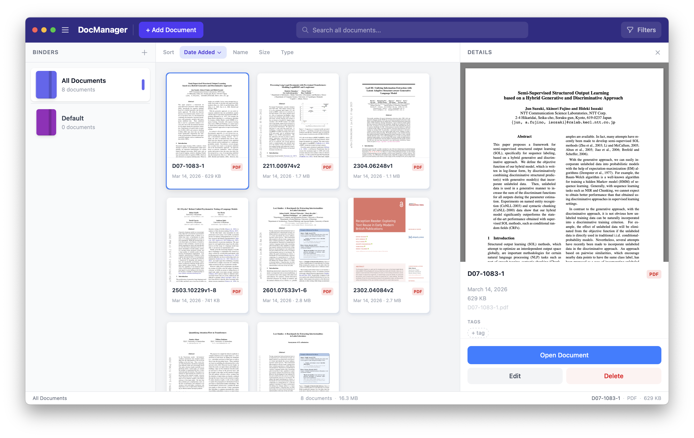

# DocManager

A native macOS document manager built with [Tauri v2](https://tauri.app), React 19, TypeScript, and Tailwind CSS v4. Import, organise, tag, and preview your documents — all stored locally on your Mac.



## Features

- **Import documents** — PDF, DOCX, XLSX, images, and plain text via the file picker or drag-and-drop from Finder
- **Automatic thumbnails** — generated with Quick Look (`qlmanage`) for PDFs and Office files, or `sips` for images
- **Binders** — create colour-coded binders that filter documents by tag
- **Inline tag editing** — add, rename, and remove tags directly in the details pane
- **Full-text search** — filter by title and filter by tag simultaneously
- **Sort** — by date added, name, file size, or file type
- **Inline PDF/image preview** — rendered inside the resizable details pane
- **Persistent storage** — state saved as JSON in `~/Library/Application Support/com.document-manager.app/`
- **Duplicate detection** — SHA-256 hash check prevents importing the same file twice

---

## Prerequisites

All of the following must be installed before you build the app.

### 1 — Xcode Command Line Tools

```bash
xcode-select --install
```

### 2 — Rust (via rustup)

```bash
curl --proto '=https' --tlsv1.2 -sSf https://sh.rustup.rs | sh
# Follow the on-screen instructions, then reload your shell:
source "$HOME/.cargo/env"
```

Verify:

```bash
rustc --version   # should print rustc 1.78 or newer
```

### 3 — Node.js 18 +

The easiest way is with [nvm](https://github.com/nvm-sh/nvm):

```bash
curl -o- https://raw.githubusercontent.com/nvm-sh/nvm/v0.39.7/install.sh | bash
nvm install --lts
nvm use --lts
```

Or download the installer directly from [nodejs.org](https://nodejs.org).

Verify:

```bash
node --version   # should print v18 or newer
npm --version
```

---

## Development

Clone the repo and install JavaScript dependencies:

```bash
git clone https://github.com/your-username/document-manager.git
cd document-manager
npm install
```

Start the app in development mode (hot-reload for both React and Rust):

```bash
npm run tauri dev
```

The first run compiles the Rust crate, which takes a minute or two. Subsequent runs are much faster thanks to incremental compilation.

---

## Building a release `.app`

```bash
npm run tauri build
```

This produces a fully self-contained macOS application bundle at:

```
src-tauri/target/release/bundle/macos/Document Manager.app
```

### Install to Applications

Drag the `.app` into your `/Applications` folder, or run:

```bash
cp -R "src-tauri/target/release/bundle/macos/Document Manager.app" /Applications/
```

You can then launch it from Spotlight or Launchpad like any other app.

### Optional: create a `.dmg` installer

Tauri also generates a disk image automatically during the build:

```
src-tauri/target/release/bundle/dmg/Document Manager_0.1.0_aarch64.dmg
```

(Architecture suffix will be `x86_64` on Intel Macs.) Double-click it and drag the app to `/Applications`.

---

## Data storage

All application data lives inside:

```
~/Library/Application Support/com.document-manager.app/
├── state.json       ← document & binder metadata
├── files/           ← copies of every imported file
└── thumbnails/      ← generated PNG thumbnails
```

Deleting a document through the UI removes both the entry from `state.json` and the corresponding files from `files/` and `thumbnails/`.

---

## Tech stack

| Layer | Technology |
|-------|-----------|
| Shell | [Tauri v2](https://tauri.app) (Rust + WebView) |
| Frontend | React 19 + TypeScript |
| Styling | Tailwind CSS v4 |
| Bundler | Vite 6 |
| Persistence | `serde_json` → `state.json` |
| Thumbnails | `qlmanage` (PDFs/Office), `sips` (images) |
| Hashing | SHA-256 via the `sha2` crate |
